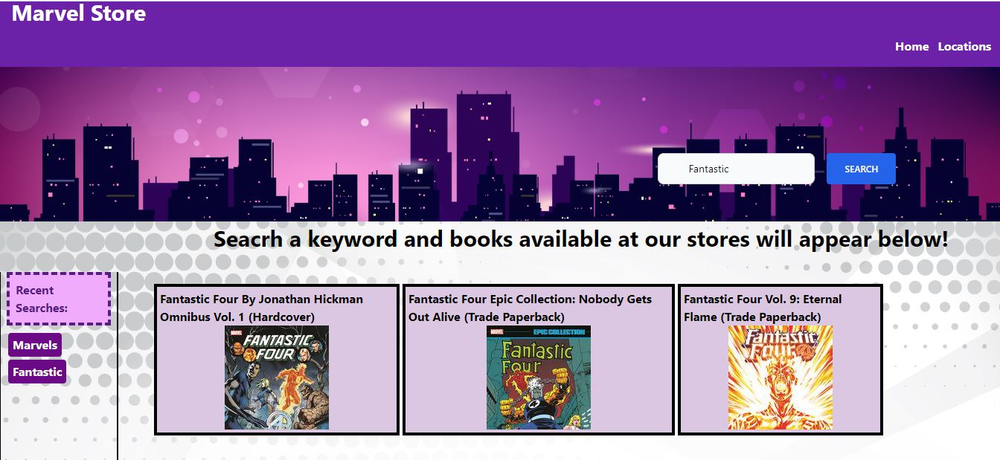
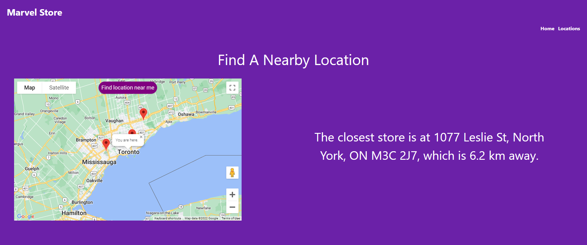

# Marvel Store

## Description

The website provides an easy to use facility for a user to find books/magazines available at the Marvel stores. The website has a search facility where the user can type in keywords to find the magazine.  Easily accessible links to the available magazines and books have been provided in the form of buttons on the site to hop on to the relevant magazine or book.

The creation of this dashboard is motivated by making it easier for customers to find what they require and expand the customer base by ease of access and increase sales.

## User story

 As I am a fan of Marvel books.  As a user I can search for my favorite magazine. I can go to my nearby store by seeing the location on the map and then browse through the books and pick the one that I like the most.

## Technologies used

The application is built using HTML, TailwindCSS, CSS and JavaScript. Other server Side APIs - Marvel API and Google Maps API**

**Note source of code in "style.css, working.js and location-script.js" is as follows:

 *Google. (n.d.). Google. Retrieved June 5, 2022, from https://developers.google.com/maps/documentation/javascript/examples/map-geolocation*

## Screenshots

## Link to deploy the application

https://katyayini.github.io/goldenearth/
